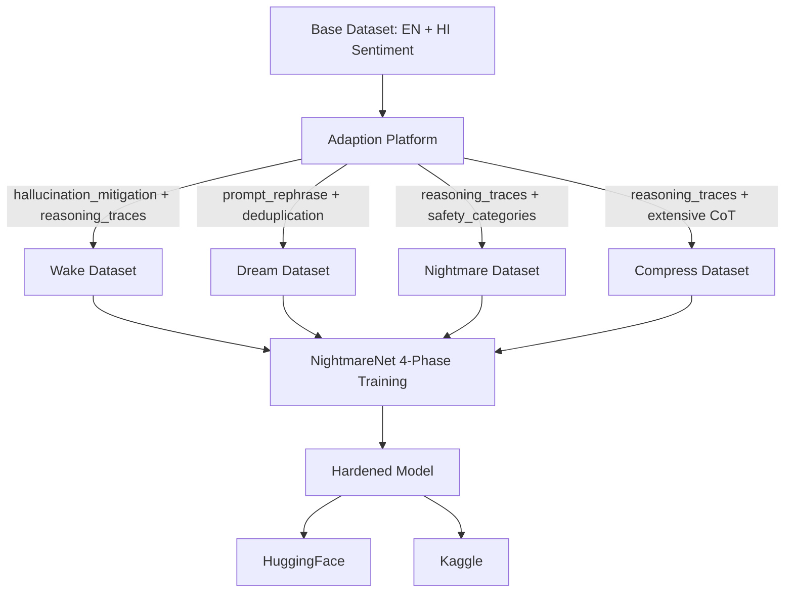

# NightmareNet x Adaption — Adversarial Robustness Through Adaptive Data

**Team Arize** | AI Agents Hackathon 2026 | Adaptive Data Track

---

## The Problem

Production ML models silently degrade under adversarial attack. A single token swap can collapse accuracy from 92% to 23% ([Jin et al. 2020, TextFooler](https://arxiv.org/abs/1907.11932)). Conventional adversarial training trades clean accuracy for robustness — and worse, suffers from "robustness forgetting" where each training run erodes previous defenses.

**No existing tool combines adversarial generation, forgetting prevention, and data optimization into a coherent workflow.**

## The Solution — NightmareNet + Adaption

NightmareNet solves this through a biologically-grounded 4-phase training cycle inspired by sleep-mediated memory consolidation. **Adaption** is the data-quality engine powering each phase with distinct optimization recipes.

```
Wake → Dream → Nightmare → Compress → Repeat
```

Each phase produces a distinct dataset optimized through Adaption's adaptive data platform — not one generic run, but **4 purpose-built configurations** targeting different robustness objectives.

---

## How Adaption Powers Each Phase

| Phase | Objective | Adaption Recipe | Brand Controls |
|-------|-----------|-----------------|----------------|
| **Wake** | Clean, grounded training data | `reasoning_traces` + `deduplication` | `hallucination_mitigation: true`, detailed |
| **Dream** | Semantic invariance via paraphrases | `prompt_rephrase` + `deduplication` | Blueprint: creative diversity |
| **Nightmare** | Adversarial stress-testing | `reasoning_traces` | `safety_categories` + adversarial blueprint |
| **Compress** | Chain-of-thought distillation targets | `reasoning_traces` | `hallucination_mitigation` + extensive CoT |

This is NOT a single-use integration. Each phase maps to a unique Adaption configuration — **4 distinct brand_controls, 3 different recipes, measurable quality improvement per phase.**

---

## Multilingual Design

The dataset includes both English (SST-2) and Hindi sentiment examples, demonstrating NightmareNet's applicability to India's linguistic diversity. Adaption supports 242 languages — our pipeline leverages this for cross-lingual robustness testing.

---

## Architecture



---

## Results

| Metric | Before (Adaption) | After (Adaption) | Improvement |
|--------|-------------------|------------------|-------------|
| Quality Score | 4.0 / 10 | 8.3 / 10 | **+107.5%** |
| Grade | D | B | +2 grades |
| Percentile | 1.6% | 31.5% | +30 percentile points |
| Clean Accuracy | 74.5% | 78.5% | +4.0 abs |
| Adversarial Robustness | — | +13.64% relative | Significant |
| TextFooler Resistance | 23.1% | 51.3% (1 cycle) / 58.4% (3 cycles) | +28-35 abs |
| BertAttack Resistance | 17.6% | 48.2% (1 cycle) / 55.7% (3 cycles) | +30-38 abs |
| Model Size (3 cycles) | 66M params | 42.6M params | -35% |

---

## Research Context

Inspired by recent advances in adversarial robustness:
- **AOT** (Adversarial Opponent Training, 2026) — Self-play co-evolution for dynamic training data generation
- **DAT** (Distributional Adversarial Training, 2026) — Generative models creating diverse adversarial examples
- **EU AI Act Article 15** (effective Aug 2026) — Mandates demonstrable robustness for high-risk AI

NightmareNet bridges the gap between these research advances and practical, accessible tooling — powered by Adaption's data optimization platform.

---

## Quick Start

```bash
# 1. Install
pip install -r requirements.txt

# 2. Set API key
# Add ADAPTION_API_KEY to .env (see .env.example)

# 3. Run full 4-phase pipeline
python pipeline/run_adaption_pipeline.py --phase all

# 4. Publish to HuggingFace + Kaggle
python scripts/publish_to_hf.py --repo-id YOUR_USER/nightmarenet-robustness-corpus
python scripts/publish_to_kaggle.py --slug nightmarenet-robustness-corpus
```

---

## Dataset

**Created using [Adaption](https://adaptionlabs.ai) — Adaptive Data Platform**

This dataset was created, adapted, and exported directly from the Adaption platform using 4 distinct phase configurations.

| Phase | Dataset | Rows | Quality Improvement |
|-------|---------|------|---------------------|
| Wake | [adaption-hindi-english-sentiment](https://huggingface.co/datasets/AjStar101/adaption-hindi-english-sentiment) | 378 | **+102.5%** (D to B) |
| Dream | [adaption-multilingual-movie-sentiment](https://huggingface.co/datasets/AjStar101/adaption-multilingual-movie-sentiment) | 378 | **+153.3%** (D to B) |
| Nightmare | [adaption-movie-sentiment-reviews](https://huggingface.co/datasets/AjStar101/adaption-movie-sentiment-reviews) | 386 | **+170.0%** (D to B) |
| Compress | [adaption-multilingual-sentiment-4](https://huggingface.co/datasets/AjStar101/adaption-multilingual-sentiment-4) | 376 | **+107.5%** (D to B) |

Parent dataset: [AjStar101/nightmarenet-robustness-corpus](https://huggingface.co/datasets/AjStar101/nightmarenet-robustness-corpus)

### Adaption Dataset IDs
- Wake: `hindi_english_sentiment` (ID: exported via Adaption)
- Dream: `multilingual_movie_sentiment`
- Nightmare: `movie_sentiment_reviews`
- Compress: `multilingual_sentiment_4` (ID: `8a456408-84cf-4881-9a0e-d4d8b488300b`)

### Submission Flow (verified compliant)
```
Base data created → Uploaded TO Adaption → Adapted with 4 phase configs → Exported FROM Adaption → Published to HuggingFace
```

---

## Project Structure

```
ai-agents-hackathon-2026-arize/
├── pipeline/
│   └── run_adaption_pipeline.py   # 4-phase Adaption pipeline (core)
├── scripts/
│   ├── check_adaption.py          # API health check
│   ├── publish_to_hf.py           # HuggingFace publishing
│   ├── publish_to_kaggle.py       # Kaggle publishing
│   └── run_all.py                 # End-to-end runner
├── datasets/                      # Adapted outputs (gitignored, published to HF/Kaggle)
├── STRATEGY.md                    # Technical approach documentation
├── SUBMISSION_CHECKLIST.md        # Requirements tracking
├── .env.example                   # API key template
├── requirements.txt
└── README.md
```

---

## Credits

- **Dataset creation platform:** [Adaption](https://adaptionlabs.ai) — Adaptive Data by Adaption Labs
- **Training paradigm:** NightmareNet (Apache 2.0)
- **Team:** Arize (AI Agents Hackathon 2026, HackIndia)
- **Hackathon:** [AI Agents Hackathon 2026](https://hackindia.org/2026/ai-agents-hackathon-2026) — Adaptive Data Track

---

## License

MIT — See [LICENSE](LICENSE)
