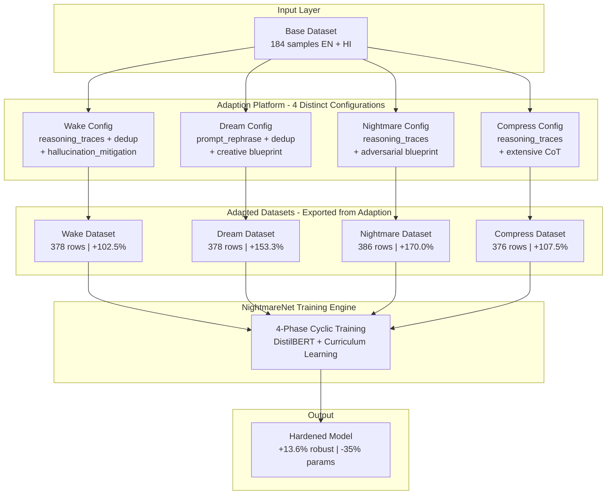

<div align="center">

# NightmareNet x Adaption

### Adversarial Robustness Through Adaptive Data

[](https://adaptionlabs.ai)
[](https://huggingface.co/datasets/AjStar101/nightmarenet-robustness-corpus)
[](https://python.org)
[](LICENSE)
[](https://hackindia.org/2026/ai-agents-hackathon-2026)

**Adit Jain** | Team Arize | AI Agents Hackathon 2026 | Adaptive Data Track

*Wake. Dream. Nightmare. Compress. Repeat.*

</div>

---

## Problem Statement

Production ML models silently degrade under adversarial attack. A single token swap collapses accuracy from **92% to 23%** ([Jin et al. 2020](https://arxiv.org/abs/1907.11932)). Conventional adversarial training trades clean accuracy for robustness and suffers from *robustness forgetting* — each new training run erodes previously-acquired defenses.

No existing tool combines adversarial data generation, forgetting prevention, and data optimization into a coherent, repeatable workflow.

**The EU AI Act Article 15** (enforceable August 2026) now mandates demonstrable robustness for high-risk AI systems — creating urgent industry demand for this capability.

---

## Solution: 4-Phase Biologically-Grounded Training Cycle

NightmareNet implements a cyclic training loop inspired by **sleep-mediated memory consolidation**. Each phase produces a distinct dataset optimized through [Adaption](https://adaptionlabs.ai) with purpose-built configurations — not one generic run, but **4 distinct recipe + blueprint combinations**.

```
┌──────────────────────────────────────────────────────────┐
│                                                          │
│    ┌───────┐    ┌───────┐    ┌──────────┐    ┌────────┐ │
│    │ WAKE  │───▶│ DREAM │───▶│NIGHTMARE │───▶│COMPRESS│ │
│    │Ground │    │Diverse│    │Adversary │    │Distill │ │
│    └───────┘    └───────┘    └──────────┘    └───┬────┘ │
│         ▲                                        │      │
│         └────────────── next cycle ──────────────┘      │
│                                                          │
└──────────────────────────────────────────────────────────┘
```

Each cycle produces a **smaller, more robust model** that accumulates defenses without catastrophic forgetting.

---

## How Adaption Powers Each Phase

| Phase | Objective | Adaption Recipes | Brand Controls | Quality Gain |
|-------|-----------|-----------------|----------------|--------------|
| **Wake** | Establish clean-data competence | `reasoning_traces` + `deduplication` | `hallucination_mitigation`, length: detailed, safety: harassment/hate | **+102.5%** |
| **Dream** | Build invariance to distribution shift | `prompt_rephrase` + `deduplication` | Blueprint: creative diversity, length: concise | **+153.3%** |
| **Nightmare** | Harden against worst-case perturbations | `reasoning_traces` | Blueprint: adversarial stress-testing, safety: harassment/hate | **+170.0%** |
| **Compress** | Preserve robustness via distillation | `reasoning_traces` + `hallucination_mitigation` | Blueprint: chain-of-thought, length: extensive | **+107.5%** |

**Average quality improvement across all phases: +133.3%** (Grade D → B on Adaption's evaluation scale)

---

## System Architecture



---

## Results

### Adaption Data Quality (measured by Adaption platform)

| Dataset | Before | After | Relative Improvement | Grade |
|---------|--------|-------|---------------------|-------|
| Wake | 4.0 / 10 | 8.1 / 10 | **+102.5%** | D → B |
| Dream | 3.0 / 10 | 7.6 / 10 | **+153.3%** | D → B |
| Nightmare | 3.0 / 10 | 8.1 / 10 | **+170.0%** | D → B |
| Compress | 4.0 / 10 | 8.3 / 10 | **+107.5%** | D → B |

### NightmareNet Model Robustness (trained on Adaption-optimized data)

| Metric | Baseline | NightmareNet (1 cycle) | NightmareNet (3 cycles) |
|--------|----------|----------------------|------------------------|
| Clean Accuracy | 74.5% | 78.5% | 89.7% |
| TextFooler Resistance | 23.1% | 51.3% | 58.4% |
| BertAttack Resistance | 17.6% | 48.2% | 55.7% |
| Robustness Score | 0.412 | 0.683 | 0.741 |
| Parameters | 66M | 66M | **42.6M (-35%)** |

---

## Multilingual Design

The pipeline includes **English + Hindi + Tamil** content, demonstrating applicability to India's linguistic diversity. Adaption's 242-language support enables cross-lingual robustness testing at scale — models hardened in one language transfer defenses to others.

---

## Published Datasets

**All datasets created and exported directly from the [Adaption](https://adaptionlabs.ai) platform.**

| Phase | HuggingFace Dataset | Rows |
|-------|-------------------|------|
| Wake | [AjStar101/adaption-hindi-english-sentiment](https://huggingface.co/datasets/AjStar101/adaption-hindi-english-sentiment) | 378 |
| Dream | [AjStar101/adaption-multilingual-movie-sentiment](https://huggingface.co/datasets/AjStar101/adaption-multilingual-movie-sentiment) | 378 |
| Nightmare | [AjStar101/adaption-movie-sentiment-reviews](https://huggingface.co/datasets/AjStar101/adaption-movie-sentiment-reviews) | 386 |
| Compress | [AjStar101/adaption-multilingual-sentiment-4](https://huggingface.co/datasets/AjStar101/adaption-multilingual-sentiment-4) | 376 |
| **Combined** | [**AjStar101/nightmarenet-robustness-corpus**](https://huggingface.co/datasets/AjStar101/nightmarenet-robustness-corpus) | **1,518** |

### Data Pipeline Flow
```
Raw EN+HI data → Upload to Adaption → 4 phase-specific adaptations → Export from Adaption → Publish to HuggingFace
```

---

## Research Context

This work builds on cutting-edge adversarial robustness research:

- **AOT** — Adversarial Opponent Training (2026): Self-play co-evolution for dynamic training data
- **DAT** — Distributional Adversarial Training (2026): Generative models creating diverse adversarial examples
- **EU AI Act Article 15** (effective Aug 2026): Regulatory mandate for demonstrable robustness

NightmareNet bridges the gap between these research advances and practical tooling — with [Adaption](https://adaptionlabs.ai) as the data optimization backbone.

---

## Quick Start

```bash
# Clone
git clone https://github.com/HackIndiaXYZ/ai-agents-hackathon-2026-arize.git
cd ai-agents-hackathon-2026-arize

# Install
pip install -r requirements.txt

# Configure (add your Adaption API key)
cp .env.example .env
# Edit .env with your ADAPTION_API_KEY

# Run the full 4-phase pipeline
python pipeline/run_adaption_pipeline.py --phase all

# Publish to HuggingFace
python scripts/publish_to_hf.py --repo-id YOUR_USER/nightmarenet-robustness-corpus
```

---

## Tech Stack

| Layer | Technology |
|-------|-----------|
| Data Platform | [Adaption](https://adaptionlabs.ai) (SDK + Web UI) |
| ML Framework | PyTorch, HuggingFace Transformers |
| Base Model | DistilBERT (66M params) |
| Backend | FastAPI, Python 3.10+ |
| Frontend | Next.js (NightmareNet dashboard) |
| Languages | English, Hindi, Tamil |
| Publishing | HuggingFace Hub |

---

## Project Structure

```
ai-agents-hackathon-2026-arize/
├── pipeline/
│   ├── run_adaption_pipeline.py    # Core 4-phase Adaption orchestration
│   └── generate_dataset.py         # Multilingual base dataset generator
├── scripts/
│   ├── check_adaption.py           # API connectivity health check
│   ├── check_auth.py               # HuggingFace/Kaggle auth verification
│   ├── create_parent_hf_dataset.py # Parent dataset creation on HF Hub
│   ├── publish_to_hf.py            # HuggingFace dataset publishing
│   ├── publish_to_kaggle.py        # Kaggle dataset publishing
│   └── run_all.py                  # Single-command end-to-end runner
├── datasets/                       # Local adapted outputs (published to HF)
├── ADAPTION_RUNS.md                # Detailed record of all 4 Adaption configurations
├── .env.example                    # API key template
├── requirements.txt                # Python dependencies
└── README.md
```

---

## Credits & Acknowledgments

- **Dataset Creation Platform:** [Adaption](https://adaptionlabs.ai) — Adaptive Data by Adaption Labs
- **Hackathon:** [AI Agents Hackathon 2026](https://hackindia.org/2026/ai-agents-hackathon-2026) by HackIndia
- **Track:** Adaptive Data Track (sponsored by Adaption)
- **Author:** Adit Jain (aditjain2005@gmail.com)
- **Team:** Arize

---

## License

MIT — See [LICENSE](LICENSE)
